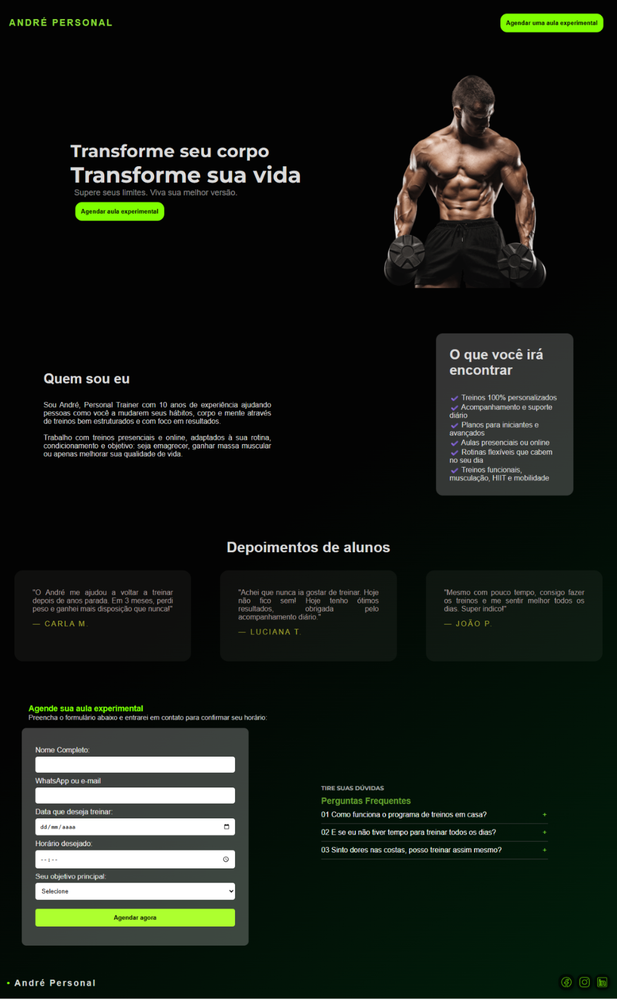

# 💪 Landing Page | Personal Trainer

Uma landing page moderna e responsiva desenvolvida para promover os serviços de um personal trainer. O projeto foi construído com foco em performance, estética e usabilidade, utilizando HTML, CSS e JavaScript puro.

---

## 📸 Preview do Projeto

---

## 🔗 Deploy

Acesse a versão online do projeto aqui: [https://structcodes.github.io/site-personal-trainer/)

---

## 🧠 Funcionalidades

- Apresentação clara dos serviços oferecidos
- Seção de depoimentos de clientes
- Formulário de contato
- Botão de chamada para ação (CTA) com destaque

---

## 🛠️ Tecnologias Utilizadas

- **HTML5**: Estrutura semântica e acessível
- **CSS3**: Estilização com Flexbox e Media Queries
- **JavaScript**: Interatividade e manipulação do DOM
- **Responsividade**: Layout adaptado para dispositivos móveis, tablets e desktops

---

## 📱 Responsividade

O layout foi cuidadosamente planejado para se adaptar a diferentes tamanhos de tela. Testado em:

- Smartphones Android e iOS
- Tablets
- Monitores widescreen e laptops

## 🙋‍♀️ Autora

Feito por **Tainá Roberta!**

